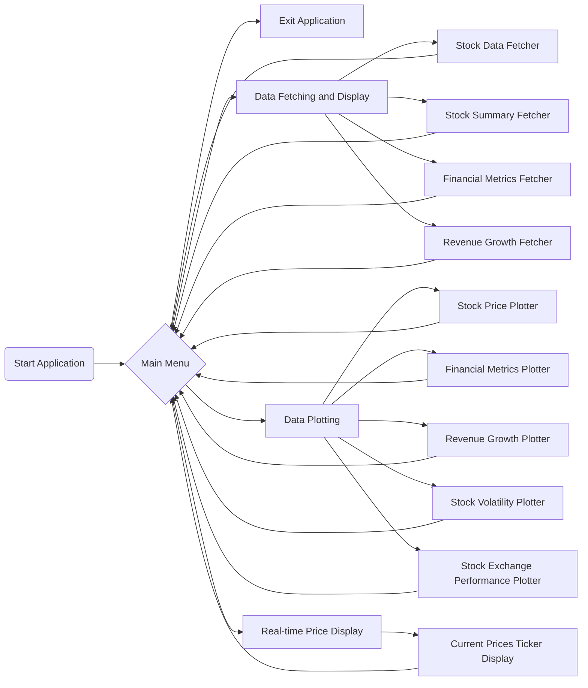

# Workflow

- [Home](../README.md)
- [Fetcher](./Fetcher.md)
- [Plotter](./Plotter.md)
- [Documentation](./documentation.md)

## Main Workflow

The `main.py` script serves as the entry point for a stock analysis application, leveraging the functionality provided by the `fetcher` and `plotter` classes from the `src` package. The script provides a user-friendly, menu-driven interface for interacting with various stock analysis tools. Here's an overview of how the classes are utilized within this script:

## Main Features

1. **Fetching and Displaying Stock Data:** The script uses classes like `StockDataFetcher`, `StockSummaryFetcher`, `FinancialMetricsFetcher`, and `RevenueGrowthFetcher` to fetch different types of stock data. It provides functions to display historical data, financial metrics, stock summaries, and revenue growth for specified stock tickers.

2. **Plotting Stock Data:** For data visualization, the script incorporates `StockPricePlotter`, `FinancialMetricsPlotter`, `RevenueGrowthPlotter`, `StockVolatilityPlotter`, and `StockExchangePerformancePlotter`. These plotters generate various plots, including closing prices, moving averages, financial metrics histograms, revenue growth bar charts, rolling volatility, and comparative performance of stock indices.

3. **Real-time Price Display:** Using `CurrentPricesTickerDisplay`, the script can show a dynamic, rolling display of current stock prices in a ticker-like format.

### Usage Patterns

- **User Input:** The script prompts users to enter stock tickers, date ranges, and other parameters as required by the different functionalities.

- **Functional Modularization:** Each major functionality (fetching data, plotting, real-time display) is encapsulated in separate functions within `main.py`, such as `use_stock_data_fetcher()`, `use_stock_price_plotter()`, and `use_current_prices_ticker_display()`. This modular approach enhances readability and maintainability.

- **Loop-driven Menu:** The script runs a loop that displays a menu of options. Users can select an option by entering the corresponding number. The loop continues until the user chooses to exit.

- **Error Handling:** While the detailed implementation of error handling is not shown, it's essential for practical applications to include error handling, especially for user inputs and network requests (for fetching data).

### Example Workflow

1. A user runs `main.py` and is presented with a menu of stock analysis options.
2. The user chooses an option by entering a number, for example, `5` for using `StockPricePlotter`.
3. The script then asks for further input, such as stock tickers and a date range.
4. Based on the input, `StockPricePlotter` is instantiated, and the requested plots are generated and displayed.
5. After completing the action, the menu is presented again, allowing the user to select another option or exit the application.

### Extensibility

The design allows for easy addition of new functionalities. Developers can introduce new fetchers or plotters as classes and integrate them into `main.py` by adding corresponding functions and menu options.

This structure not only facilitates ease of use for end-users but also provides a clear framework for developers to extend the application with more features or data sources.
